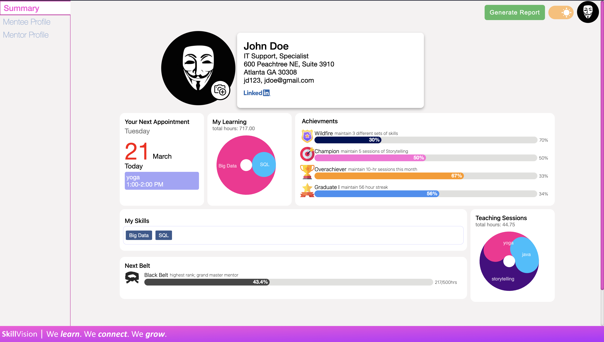

# SkillShare App &middot; ![GitHub license][MIT-license-url] ![npm version][NPM-url]
<a name="readme-top"></a>
[![React][React.js]][React-url]
[![Styled Components][Styled-Components]][Styled-Components-url]
[![Node][Node.js]][Node-url]
[![PostgreSQL][PostgreSQL]][PostgreSQL-url]

Community-based Skill Sharing app that makes learning, growing, and sharing any skill as easy as it should be.

<!-- Top-Level App Screenshot -->


<!-- Deployed Site -->
Check out the [deployed site(not yet available)](<url here>)

<!-- TABLE OF CONTENTS -->
## Table of Contents
- [Getting Started](#getting-started)
  - [Setting Environment Variables](#setting-environment-variables)
  - [Quickstart App with Demo Data(Docker Only)](#quickstart-app-with-demo-datadocker-only)
  - [For Faster Development](#for-faster-development)
- [App Features](#app-features)
- [Special Thanks](#special-thanks)
- [License](#license)

<!-- ## Video Uploads -->
<!-- video demos here -->

## Getting Started
At the root of your project duplicate the 'sample.env.dev' and rename it '.env' (optionally edit any values you would like to change)

### Setting Environment Variables
```sh
(in project root)

# Option 1: Using Docker ENV file
# create .env file from sample.env
cp -p ./sample.env ./.env

# Option 2: Using Client/Server ENV file(s)
# .env files must be created if sample.env exists inside client/server directories
cp -p ./server/sample.env ./server/.env
cp -p ./client/sample.env ./client/.env
```

### Quickstart App with Demo Data(Docker Only)
Start with docker-compose
```sh
# start with docker-compose
docker-compose up
```

Setup database (example uses demo data)
```sh
# option 1: using the bash script 
bash ./scripts/docker-db-init.sh

# option 2: using npm scripts
cd ./server
npm install
npm run migrate
npm run seed:all

# Make sure to stop and restart docker-compose to ensure changes take affect
```

Sign up or login using any on the demo user credentials from the [demo seed data](./server/database/seeders/20220119181131-demo-users.js).

### For Faster Development
Run Database with Docker
```sh
docker-compose -f docker-compose-db-only.yml up
```

Setup and Run Server App
```sh
cd ./server
npm install
# migrate + seed test data for database
npm run migrate
npm run seed:all
```

Setup and Run Client App
```sh
cd ./client
npm install
npm run start
```


## App Features
1. Login/Signup
2. Upload Avatar(profile photo)
3. Search, Book, and Rate Mentors
4. User Profile (avatar, general info, etc)
5. Mentee Awards, Milestones, and Achievements
6. Mentor SkillSharing + Rank Building
7. Exportable Performance Metrics
8. Dark Mode Theme
9. Admin Panel
10. Authentication

## Special Thanks
A quick thanks to sources for learning or sample code that helped us bring this app to life
> @RefractedColor([Codepen Profile](https://codepen.io/RefractedColor)): Dark/Light Mode Slider Component Help

## License
This app is distributed under the terms of the [MIT license](./LICENSE).

<p align="left"><a href="#readme-top">(Back to Top)</a></p>

<!----------- MARKDOWN LINKS & IMAGES --------------->
<!-- BADGE URL SYNTAX  -->
<!--  - title info: [short-link name]: https://img.shields.io/static/v1?label=<left-side-text>&message=<right-side-text>&color=<color>&style=<style-type> -->
<!--  - logo w/link: [short-link name]: https://img.shields.io/badge/<label>-<bg-color?style=<style-type>&logo=<name from simpleicon.org> -->
<!-- RESOURCE LINKS -->
<!--  - markdown links guide: https://www.markdownguide.org/basic-syntax/#reference-style-links -->
<!--  - logo names: https://simpleicons.org/ -->

<!-- Top-Lvl Title -->
[MIT-license-url]: https://img.shields.io/badge/license-MIT-blue.svg
[NPM-url]: https://img.shields.io/static/v1?label=npm&message=v8.19.3&color=blue&style=flat
<!-- Built With -->
[React.js]: https://img.shields.io/badge/React-20232A?style=for-the-badge&logo=react&logoColor=61DAFB
[React-url]: https://reactjs.org/
[Node.js]: https://img.shields.io/badge/Node.js-20232A?style=for-the-badge&logo=node.js
[Node-url]: https://nodejs.org/en/docs
[Styled-Components]: https://img.shields.io/badge/styled_components-20232A?style=for-the-badge&logo=styled-components
[Styled-Components-url]: https://styled-components.com/docs
[PostgreSQL]: https://img.shields.io/badge/PostgreSQL-20232A?style=for-the-badge&logo=PostgreSQL
[PostgreSQL-url]: https://www.postgresql.org/docs/
